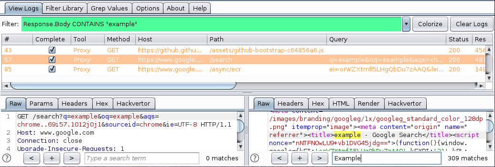
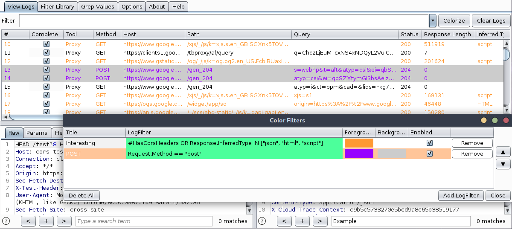
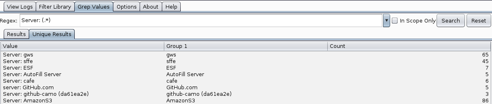

<h1 align="center">Logger++</h1>
<h4 align="center">Advanced Logging for Burp Suite</h4>

  
  
  
  
  

Developed by Corey
Arthur    
Originally by Soroush
Dalili  

Released as open source by NCC Group Plc - https://www.nccgroup.com/  
Released under AGPL-3.0 see LICENSE for more information

Description
----

Logger++ is a multithreaded logging extension for Burp Suite. In addition to logging requests and responses from all
Burp Suite tools, the extension allows advanced filters to be defined to highlight interesting entries or filter logs to
only those which match the filter.

A built in grep tool allows the logs to be searched to locate entries which match a specified pattern, and extract the
values of the capture groups.

To enable logs to be used in other systems, the table can also be uploaded to elasticsearch or exported to CSV.

<b>Features:</b>

- Works with the latest version of Burp Suite (tested on 1.7.27)
- Logs all the tools that are sending requests and receiving responses
- Ability to log from a specific tool
- Ability to save the results in CSV format
- Ability to show results of custom regular expressions in request/response
- User can customise the column headers
- Advanced Filters can be created to display only requests matching a specific string or regex pattern.
- Row highlighting can be added using advanced filters to make interesting requests more visible.
- Grep through logs.
- Live requests and responses.
- Multiple view options.
- Pop out view panel.
- Multithreaded.

<b>Current Limitations:</b>

- Cannot log the requests' actual time unless originating from proxy tool.
- Cannot calculate the actual delay between a request and its response unless originating from proxy tool.

Screenshots
----------------------

<b>Log Filters</b>

<b>Row Highlights</b>

<b>Grep Search</b>

Usage
----
You can use this extension without using the BApp store. In order to install the latest version of this extension from
the GitHub repository, follow these steps:

1. Download the [latest release jar](https://github.com/nccgroup/LoggerPlusPlus/releases/latest) .

2. In Burp Suite, click on the "Extender" tab, then in the "Extensions" tab click on the "Add" button and select the
   downloaded "loggerplusplus.jar" file.

3. You should now be able to see the "Logger++" tab in Burp Suite. If it cannot log anything, check your Burp Suite
   extension settings. If the save buttons are disabled, make sure that the requested libraries have been loaded
   successfully; Unload and then reload the extension and try again. If you have found an issue, please report it in the
   GitHub project.

4. You can configure this extension by using its "option" tab and by right click on the columns' headers.

5. If you like the project, give the repo a star! <3

Contributing
----

### Building from Source

If you'd like to build the project from source, the project uses Gradle to simplify the process:

1. Clone the repository: `git clone https://github.com/nccgroup/LoggerPlusPlus.git`
2. Within the project folder, execute `gradlew jar` (Linux) `gradlew.bat jar` (Windows)
3. Once complete, you can find the built Jar in the project's `releases` folder.

### Testing

IntelliJ Idea has been used to develop the project, but feel free to use any IDE you prefer. The following instructions
are for Idea, but the process will be similar for other IDEs.

1. Within Idea, click `File > Open`, then select the project's `build.gradle` file.
2. Click "Open as Project" in the next dialog.
3. To run/debug the application, navigate to `Run > Edit Configurations`, then add a new "Application" configuration
   targeting the `TestLogger` class.

### Reporting bugs

If you have found an issue, please report it via [GitHub](https://github.com/nccgroup/LoggerPlusPlus/issues/new/choose).
